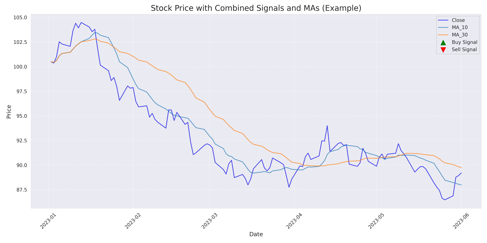
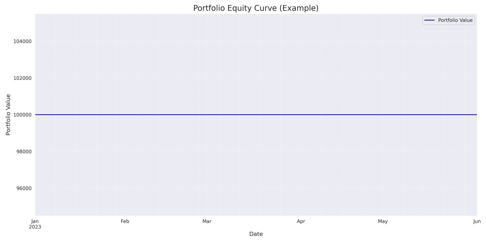

# Performance Report

Report generated on: 2025-05-24 06:25:29

## Notes
This is an example performance report generated using sample data and a majority-vote combined signal strategy.

## Key Performance Indicators (KPIs)

- **Total Return (%)**: 0.00
- **Annualized Return (%)**: 0.00
- **Sharpe Ratio**: 0.00
- **Max Drawdown (%)**: 0.00
- **Win Rate (%)**: 0.00
- **Number of Trades**: 0
- **Initial Portfolio Value**: 100000
- **Final Portfolio Value**: 100000.00
- **Peak Portfolio Value**: 100000.00
- **Lowest Portfolio Value (Drawdown)**: 100000.00

## Visualizations

### Price & Signals Plot

### Equity Curve

